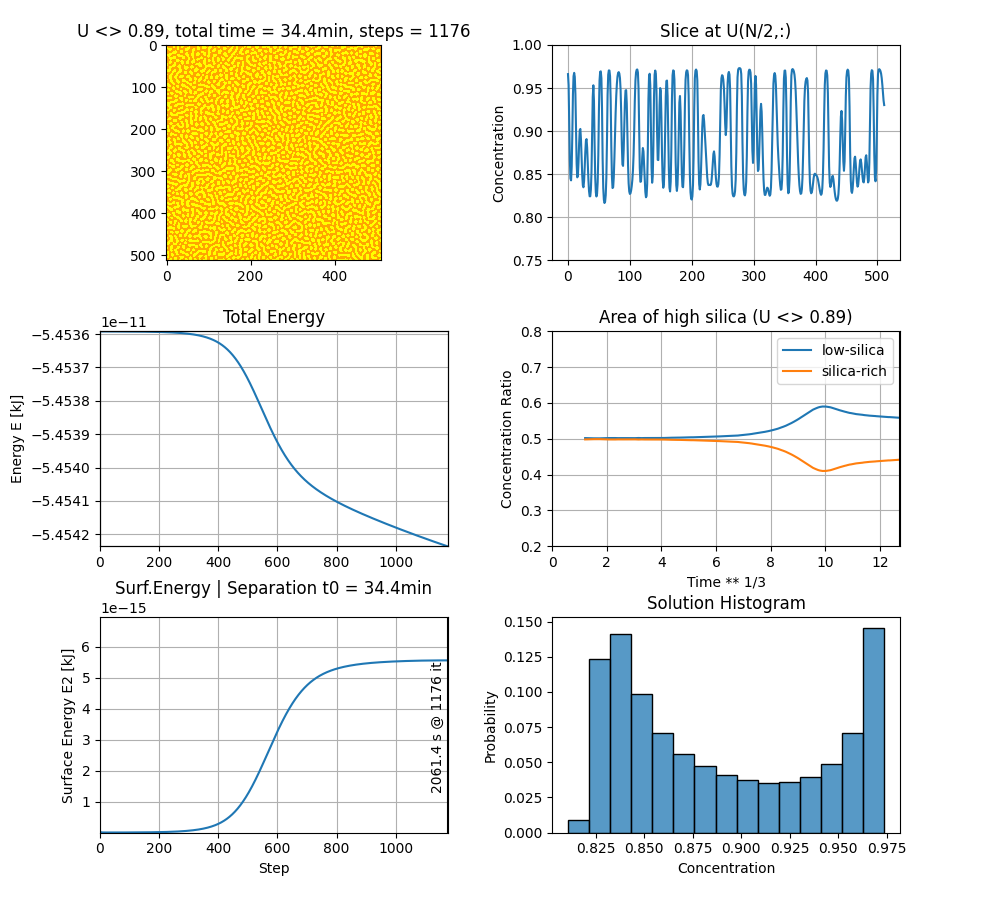

# chsimpy

chsimpy is a python3 simulation code to solve the Cahn–Hilliard equation for phase separation of Na2O-SiO2 glasses under uncertainty.
It provides an optional non-interactive graphical interface, which also can update its results during the simulation to see its progress.
Parameters can be changed via command-line interface (CLI) or jupyter notebook.
Most of the data can also be exported for post-processing and reproducibility.

## Installation

Currently there is no automated installation routine, just clone from github and install the required python packages:

```bash
git clone https://github.com/uncertaintyhub/chsimpy.git
cd chsimpy
pip install -r requirements.txt  # edit if version requirements are too tight
```

## Usage

Go to the chsimpy examples folder and run the code via python:

```bash
# git clone https://github.com/uncertaintyhub/chsimpy.git
# cd chsimpy
cd examples
python . -h # help
```

The help provides information on the command-line interface (CLI) arguments:

```
usage: chsimpy [-h] [--version] [-N N] [-n NTMAX] [-t TIME_MAX] [-z] [-a] [--cinit CINIT] [--threshold THRESHOLD] [--temperature TEMPERATURE] [--A0 A0] [--A1 A1] [-K KAPPA_BASE] [--dt DT]
               [-g {uniform,perlin,sobol,lcg}] [-s SEED] [-j JITTER] [-p PARAMETER_FILE] [--Uinit-file UINIT_FILE] [-f FILE_ID] [--no-gui] [--png] [--png-anim] [--yaml]
               [--export-csv EXPORT_CSV] [-C] [--update-every UPDATE_EVERY] [--no-diagrams]

Simulation of Phase Separation in Na2O-SiO2 Glasses under Uncertainty (solving the Cahn–Hilliard (CH) equation)

options:
  -h, --help            show this help message and exit
  --version             show program's version number and exit

Simulation:
  -N N                  Number of pixels in one domain (NxN) (default: 512)
  -n NTMAX, --ntmax NTMAX
                        Maximum number of simulation steps (might stop early, see --full-sim) (default: 1000000)
  -t TIME_MAX, --time-max TIME_MAX
                        Maximal time in minutes to simulate (ignores ntmax) (default: None)
  -z, --full-sim        Do not stop simulation early when energy falls (default: False)
  -a, --adaptive-time   Use adaptive-time stepping (approximation, experimental) (default: False)
  --cinit CINIT         Initial mean mole fraction of silica (default: 0.875)
  --threshold THRESHOLD
                        Threshold mole fraction value to determine c_A and c_B (should match --cinit) (default: 0.875)
  --temperature TEMPERATURE
                        Temperature in Kelvin (default: None)
  --A0 A0               A0 value (ignores temperature) [kJ / mol] (default: None)
  --A1 A1               A1 value (ignores temperature) [kJ / mol] (default: None)
  -K KAPPA_BASE, --kappa-base KAPPA_BASE
                        Value for kappa = K/105.1939 [kappa = kJ/mol] (default: 30)
  --dt DT               Time delta of simulation (default: 1e-11)
  -g {uniform,perlin,sobol,lcg}, --generator {uniform,perlin,sobol,lcg}
                        Generator for initial random deviations in concentration (default: None)
  -s SEED, --seed SEED  Start seed for random number generators (default: 2023)
  -j JITTER, --jitter JITTER
                        Adds noise based on -g in every step by provided factor [0, 0.1) (much slower) (default: None)

Input:
  -p PARAMETER_FILE, --parameter-file PARAMETER_FILE
                        Input yaml file with parameter values (overwrites CLI parameters) (default: None)
  --Uinit-file UINIT_FILE
                        Initial U matrix file (csv or numpy bz2 format). (default: None)

Output:
  -f FILE_ID, --file-id FILE_ID
                        Filenames have an id like "solution-<ID>.yaml" ("auto" creates a timestamp). Existing files will be OVERWRITTEN! (default: auto)
  --no-gui              Do not show plot window (if --png or --png-anim. (default: False)
  --png                 Export solution plot to PNG image file (see --file-id). (default: False)
  --png-anim            Export live plotting to series of PNGs (--update-every required) (see --file-id). (default: False)
  --yaml                Export parameters to yaml file (see --file-id). (default: False)
  --export-csv EXPORT_CSV
                        Solution matrix names to be exported to csv (e.g. ...="U,E2") (default: None)
  -C, --compress-csv    Compress csv files with bz2 (default: False)
  --update-every UPDATE_EVERY
                        Every n simulation steps data is plotted or rendered (>=2) (slowdown). (default: None)
  --no-diagrams         No diagrams or axes, it only renders the image map of U. (default: False)
```

## Notebooks

Install jupyter on your system. Perhaps further packages are required:

```bash
pip install PyQt5 ipympl
```

Run in chsimpy folder:

```bash
# in /chsimpy
jupyter notebook
# notebook files can be found in examples/
```

## Experiments

An example for running parameter experiments can be found in `experiments/`.
It uses multi-processing to execute multiple simulation at once with varying parameters (A0, A1 in our case).
The random numbers are controlled by the seed which is defined by the iteration number, so the outcome does not depend on the parallelization.
The CLI is extended by additional arguments.

```bash
cd experiments/
python experiment.py -h # help
```
The help text includes the main help from above and additionally:
```bash
# (main help from above)
# ...
Experiment:
  -R RUNS, --runs RUNS  Number of Monte-Carlo runs (default: 3)
  -S, --skip-test       Skip initial tests and validation [TODO]. (default: False)
  -P PROCESSES, --processes PROCESSES
                        Runs are distributed to P processes to run in parallel (-1 = auto) (default: -1)
  --independent         Independent A0, A1 runs (varying A0 and A1 runs separately. (default: False)
  --A-file A_FILE       File with A0,A1 values (pairs row by row) (default: None)
  --A-grid              Using evenly distributed grid points in A0 x A1 domain (sqrt(runs) x sqrt(runs)) (default: False)
```

## Tests

Only very basic tests can be found in `tests/`. It includes a small simulation, where the result is compared against the result of a pre-run non-public Matlab simulation. The validation dataset can be found in `validation/`. There is a script `tests/run-tests.sh` to run the tests and things like benchmark or GUI visualization (user has to close to continue tests script).

## Benchmark

Benchmarks of the simulation code are run by `examples/benchmark.py` (for more arguments check `python benchmark.py --help`).

```bash
python benchmark.py -N 512 -n 100 -R 3  # 512x512 domain, 100 steps, 3 runs
```

## Docker / Jupyter

A dockerfile is provided to create a chsimpy-based jupyter application container. Use the scripts in the `docker/` folder to build and run the container.

```bash
# git clone https://github.com/uncertaintyhub/chsimpy.git
# cd chsimpy/docker
# cat build-docker.sh                                                                                                                                             main ✭ ✱ ◼
export DOCKER_BUILDKIT=1 # requires docker-buildx
docker build -t chsimpy-docker:v1 .
# cat run-docker.sh
docker run -it --rm -p 8888:8888 \
     -w /home/jordan/work \
     -v $(pwd)/..:/home/jordan/work \
     chsimpy-docker:v1
```

Get or click on the link given in the `docker run ...` output above.
If the port `8888` is already in use, try `-p 8889:8888` or a different port. The URL to jupyterlab must be adapted manually then:

```
http://127.0.0.1:8889/lab?token=xxx
```

The jupyterlab GUI provides a file browser of the actual chsimpy directory. The example notebook files (`*.ipynb`) can be found in `examples/`.

Of course, using the docker container is **not necessary**. If jupyter notebook and python modules are installed on the system (see root `/requirements.txt`), then just run `jupyter notebook` in the chsimpy directory to start the jupyter server and take the provided link.


## Plots

The simulation results can be displayed as a single image of the concentration or by a set of diagrams.





## Project status

The project is currently under development. Feel free to open issues or pull-requests to contribute.
